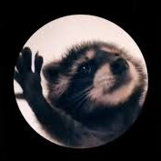

Резюме
======
### Имя: 
Эл Педро

### Фото:

### [Официальное видео-резюме](https://www.youtube.com/shorts/jw3jjN8kCyo)

### Основная информация:
- Енот-полоскун
- Почта: pedropedropedro@pedro.pe

### Образование:
- **Школа крутящихся енотов** (Золотая медаль)

### Опыт работы:
|Должность|Период работы|
|---------|-------------|
|Официант в ресторане "*У Енота*"|2021-2023|
|Диджей клуба "*Club*"|2023 - наст. время|

### Навыки:
- Владение итальянским языком
- Владение *особым* чувством ритма
- Умение порвать всех на танцполе

### Положительные качества:
- Енот
- Не кусаюсь
- Умею танцевать

### Отрицательные качества:
- Что это такое?

### Рекомендации:
> Pedro, Pedro, Pedro, Pedro, Pe. Praticamente il meglio di Santa Fè. - *Рафаэлла Карра, Директриса клуба "Club"*
